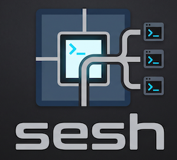

# Sesh

    

Sesh is a coding session management tool.

## Prerequisites
- `tmux`
- `Neovim`
- `Pi`
- `fzf`
- `Claude Code`

The motivation for this tool was to streamline my local development workflow with one command for a new task.

### Setup
Sets up the Sesh state file and `tmux` hooks.

> `sesh setup`

This is necessary to enable session persistence. Sesh will persist your sessions so if you ever exit you can easily reload the last state.

### Save
Saves the current `tmux` state.

> `sesh save`

This command is mostly internal and will be run automatically on certain `tmux` hooks. However, you're free to run this to save the current state of the `tmux` session.

### Load
Loads the last saved state of `tmux`

> `sesh load`

This command will load the last saved `tmux` state. It currently only spins up the panes and opens them at the last known directory.

### Start
Starts a session

> `sesh start`

- run `sesh start` (optional flag `-s session-name` to skip the prompt)
- Sesh will create a detached branch from the current directory and attach the session name to it
- Sesh will then open an `fzf` picker where you can select the worktree to work on. If selected - Sesh will either open the existing session on `tmux` or create a new session if none exists
- Sesh will then spin up a `tmux` session with 4 panes: `Pi`, `Neovim`, `Terminal`, and `Claude` all in the new worktree's working directory

### Destroy
Destroys a session

> `sesh destroy`

- run `sesh destroy`
- Sesh will open an `fzf` picker for you to choose the worktree branch to destroy
- After selecting, Sesh will take care of removing the worktree and killing the corresponding `tmux` session

